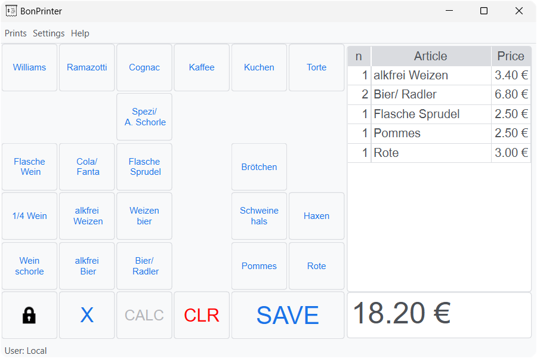

\mainpage BonPrinter

\tableofcontents

# BonPrinter

## Über ℹ️

Das Tool BonPrinter dient ausschließlich zur Berechnung des Gesamtpreises einzelner Artikel. Über einen angeschlossenen Thermodrucker wird für jeden Artikel eine Wertmarke ausgegeben.

## Funktionalitäten 🥇

* Artikelpreise berechnen (inkl. Wechselgeldrechner)
* Drucken von Wertmarken → Thermodrucker erforderlich
* Benutzerauthentifizierung über Chipkarte → Kartenleser erforderlich
* Protokollierung der Druckvorgänge pro Benutzer

## Download ☁️ ⬇️

Die freigegebenen Versionen sind auf GitHub veröffentlicht und können dort [heruntergeladen](https://github.com/timounger/BonPrinterHome/releases/latest) werden.

## Bedienung 👆️

Im Tool kann über das Menüband (`Help` → `Show Help`) die Hilfe zur Bedienung und Konfiguration aufgerufen werden.

## Feedback / Bugmeldung 🐞

Im Fehlerfall bitte den Entwickler mit den Fehlerdetails (falls der Dialog "Unexpected error occurred" erscheint) und der Logdatei (`bonprinter_log.log`) dem Entwickler melden.

Falls der Fehler reproduzierbar ist, bitte vorher über das Menüband (`Settings` → `Log Verbosity`) das Log Level auf `DEBUG` stellen.

Mail: [bonprinter@gmx.de](mailto:bonprinter@gmx.de)
