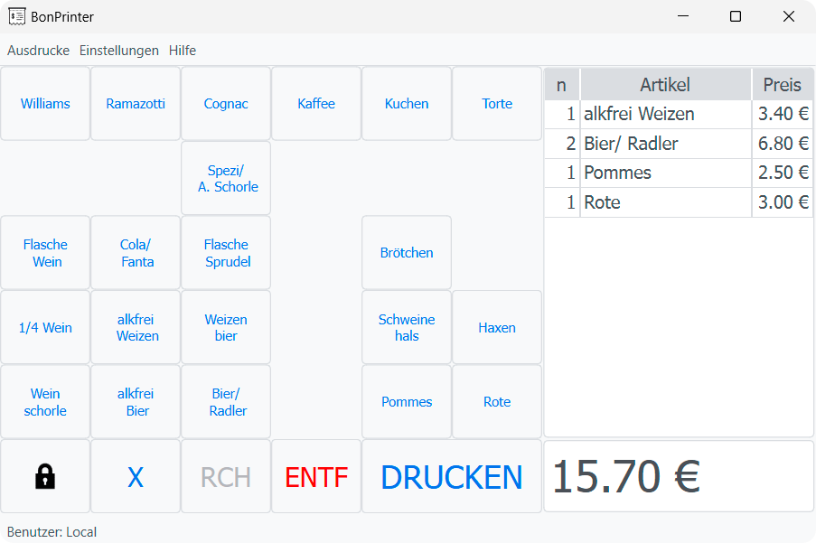

\mainpage BonPrinter

\tableofcontents

# BonPrinter

## Über ℹ️

Das Tool BonPrinter dient ausschließlich zur Berechnung des Gesamtpreises einzelner Artikel. Über einen angeschlossenen Thermodrucker wird für jeden Artikel eine Wertmarke ausgegeben.

## Funktionalitäten 🥇

- Artikelpreise berechnen
- Drucken von Wertmarken
- Benutzerauthentifizierung
- Protokollierung der Druckvorgänge

## Download ☁️ ⬇️

Die freigegebenen Versionen sind auf GitHub veröffentlicht und können dort [heruntergeladen](https://github.com/timounger/BonPrinterHome/releases/latest) werden.

## Bedienung 👆️

Im Tool kann über das Menüband (`Help` → `Show Help`) die Hilfe zur Bedienung und Konfiguration aufgerufen werden.

## Feedback / Bugmeldung 🐞

Im Fehlerfall senden Sie bitte die Meldung mit den Fehlerdetails (falls der Dialog "Unexpected error occurred" erscheint) und die Logdatei (`bonprinter_log.log`) an den Entwickler.

Falls der Fehler reproduzierbar ist, bitte vorher über das Menüband (`Settings` → `Log Verbosity`) das Log Level auf `DEBUG` stellen.

Mail: [bonprinter@gmx.de](mailto:bonprinter@gmx.de)

## OS Support

Getestet mit

- Windows 11, Windows 10

## Credits

Besonderen Dank an alle Mitwirkenden:
  

